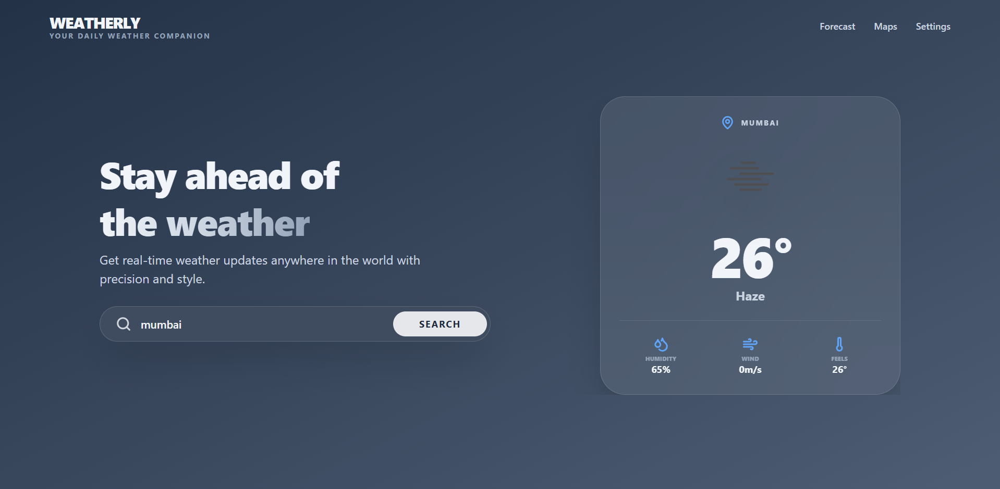

# Weatherly - Full-Stack Weather Forecast Application 🌦️

A professional, immersive weather forecasting application built with a modern full-stack architecture. The project provides real-time weather updates with a premium, zero-scroll hero interface and robust backend integration.

## 🚀 Features

- Immersive Hero UI: A centered, non-scrollable dashboard design for a premium user experience.
- Real-time Data: Live weather updates including temperature, humidity, wind speed, and "feels like" metrics.
- Smart Search: Input normalization and validation to handle messy city names and empty states.
- Default Preview: Automatically displays a default city (London) on initial load or when search is cleared.
- Advanced Polish: Glassmorphism effects, floating icon animations, and dynamic state transitions.
- Toast Notifications: Real-time feedback for successful data loads and specific error scenarios.
- Backend Proxy: Secure API communication through a Node.js middleware to protect sensitive API keys.

## 🏗️ Tech Stack

### Frontend

- React.js: Component-based UI development.
- Tailwind CSS v4: Advanced styling and immersive layout design.
- Lucide React: Premium vector icons.
- React Hot Toast: Modern notification system.
- Axios: Promise-based HTTP client for API requests.

### Backend

- Node.js & Express.js: Scalable server-side infrastructure.
- Morgan: HTTP request logger for development.
- Cors: Cross-Origin Resource Sharing management.
- Dotenv: Secure environment variable management.

### API

- OpenWeatherMap: Source for global meteorological data.

## 🔗 Architecture Flow

The application follows a secure proxy architecture to ensure performance and security:

1. User Input: User enters a city name in the React frontend.
2. Frontend Request: The client sends a request to the local Node.js backend using query parameters.
3. Backend Proxy: The Express server receives the request, injects the private API key, and calls the OpenWeatherMap API.
4. Data Processing: The backend normalizes the external API response and handles potential errors (e.g., 404 City Not Found).
5. UI Update: The frontend receives the processed data and updates the state, triggering smooth transitions and animations.

## 📂 Folder Structure

```text
weather_forecast_application/
├── backend/                # Express.js Server
│   ├── src/
│   │   ├── controllers/    # Request handling & validation
│   │   ├── services/       # External API communication
│   │   └── server.js       # Entry point & middleware
│   └── .env                # Private credentials
├── frontend/               # React Application
│   ├── src/
│   │   ├── App.jsx         # Main UI component
│   │   ├── index.css       # Global styles & animations
│   │   └── main.jsx        # React entry point
│   └── .env                # Client-side configuration
└── screenshots/            # UI Preview images
```

## ⚙️ Environment Variables

### Backend (.env)

```env
PORT=5000
API_KEY=your_openweathermap_api_key
```

### Frontend (.env)

```env
VITE_API_BASE_URL=http://localhost:5000/api
```

## ▶️ Installation & Setup

### 1. Clone the repository

```bash
git clone <repository-url>
cd weather_forecast_application
```

### 2. Backend Setup

```bash
cd backend
npm install
# Create .env and add your API_KEY
npm run dev
```

### 3. Frontend Setup

```bash
cd frontend
npm install
# Create .env and add VITE_API_BASE_URL
npm run dev
```

## 🧪 Usage Instructions

1. Ensure both the backend and frontend servers are running.
2. Open the application in your browser (default: http://localhost:5173).
3. View the default weather for London on the immersive dashboard.
4. Use the search bar to enter any city name worldwide.
5. Clear the search bar to instantly return to the default hero state.

## 📸 Screenshots

 <p align="center"> 
    
 </p>
